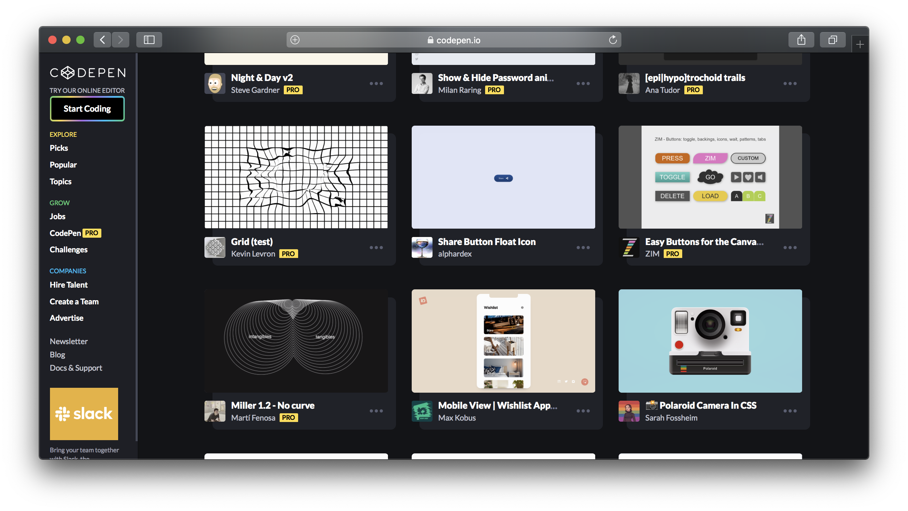

Licence CC BY-NC-ND
Thierry Parmentelat

+++

# online tools

+++ {"slideshow": {"slide_type": "slide"}}

## many great online tools

+++

* it is sometimes unconvenient to deal with  
  the 3 formalisms HTML - CSS - JavaScript
  in 3 separate files
* esp. for working on, or sharing  
  code snippets that outline a specific trick
* many online tools are available, most famous being
  * <https://codepen.io> 
  * also <https://jsfiddle.net> for collaborative work

+++ {"slideshow": {"slide_type": "slide"}}

## codepen

take a quick look at https://codepen.io/spark
for great examples
(may require log in)

+++ {"slideshow": {"slide_type": "slide"}}

each snippet can be edited online and rendered as you work on it

