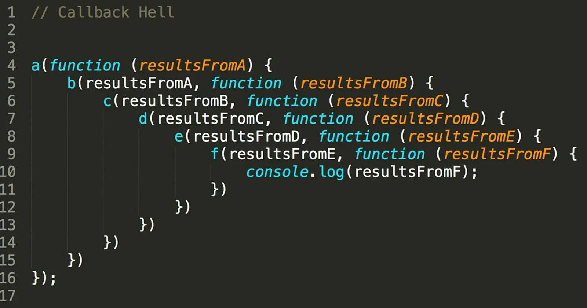

+++ {"slideshow": {"slide_type": "slide"}}

<div class="licence">
<span>Licence CC BY-NC-ND</span>
<span>Thierry Parmentelat</span>
</div>

+++ {"slideshow": {"slide_type": ""}}

# JavaScript asynchronous behaviour

```{code-cell}
delete require.cache[require.resolve('../js/toolsv3')]
tools = require('../js/toolsv3')
tools.init()
```

+++ {"slideshow": {"slide_type": "slide"}}

##  summarize why

* remember that fetching data from the Internet is slow (see intro)
* not wasting time to wait for each component
* prefer to create content as soon as possible to hide some latency
* do not use a busy loop that wastes CPU cycles
* fetch resources concurrently whenever possible
* run code concurrently whenever possible

+++ {"slideshow": {"slide_type": "slide"}}

## page loading issue

* the issue is due to the fact that in most cases, code **order matters**
* for instance you cannot get an element from code that was not yet created
* you cannot use a given JavaScript library if its code has not finished loading
* dependency may be very tricky, and can end in a dependency loop  
  as in *`a` requires `b` that requires `a`*

+++ {"slideshow": {"slide_type": "slide"}}

## general issue

* the code can become the *callback hell* by cascading callbacks
* refer to the example on catching key and mouse events  
  observe how a set of **linear** tasks  
  (load page, arm callbacks, trigger callbacks)  
  results in **nested** callbacks
   
* to mitigate the issue there are 2 tools
  * promise
  * `async`/`await`

+++ {"slideshow": {"slide_type": "slide"}}

## promises - what for

+++

a relatively new alternative to callbacks that tries to address  
the issues known as either

* the 'Callback Hell'
  
* also known as the 'Pyramid of Doom' 
  
  
i.e. a programming technique where an essentially **sequential** business  
ends up creating a **deeply nested** program structure

+++ {"slideshow": {"slide_type": "slide"}}

## promises - example

+++ {"slideshow": {"slide_type": ""}}

the following example tries to illustrate

* that promises will let us write a sequential task linearly
* that they can deal with error conditions
* and that they allow to pass return values along the chain

as you will see however, it clearly takes some time until you get to read promises fluently :)

```{code-cell}
---
slideshow:
  slide_type: slide
---
// the next cell will 
// run OK  the first time
// and fail the second time
// and so on...

failure_toggle = 1
```

```{code-cell}
---
slideshow:
  slide_type: slide
---
// run this cell several times over

new Promise(
    function (resolve, reject) {

        // make it work or fail every other time
        failure_toggle = ! failure_toggle

        // a promise must use resolve or reject exactly once
        // depending on successful or not
        if (failure_toggle) {
            // in case of failure, do not wait
            reject(1)
        } else {
            // in case of success, wait for 1 s
            console.log('before')
            setTimeout(
                () => { 
                    console.log("after 1s")
                    resolve(10)
                },
            1000)
        }
    }
).then(
    // first argument to then is 
    // what to do in case of success (resolve is used)
    (result) => {
        console.log(result)
        return result * 2
    },
    // second argument is what to do
    // in the cases where reject is called
    (result) => console.log(`error with ${result}`)
).then(
    function (result) {
        console.log(result)
        return result * 3
    }
)
```

## `async` keyword

+++

with `async` you can declare functions that return a `Promise` by default

```{code-cell}
// when called this fonction will return a Promise
// this code behaves almost like the previous code, except
// for the 1s delay (which will be in the next version)

// it will alternatively
// fail immediately
// succeed and return 10 - immediately also for now
async function foo1() {
    // make it work or fail every other time
    failure_toggle = ! failure_toggle

    // a promise must use resolve or reject exactly once
    // depending on successful or not
    if (failure_toggle) {
        // in case of failure, do not wait
        throw 1 // Equivalent to reject(1);
    } else {
        // in case of success, wait for 1 s
        return 10 // Equivalent to resolve(1);
    }
}
```

```{code-cell}
// run this cell several times over

// so we can call the function 
// and use the result as a Promise
foo1()
  .then(
    // first argument to then is in case of success (resolve is used)
    (result) => {
        console.log(result)
        return result * 2
    },
    // second is for the cases where reject is called
    (result) => console.log(`error with ${result}`))
  .then(
    function (result) {
        console.log(result);
        return result * 3
    }
)
```

## `await` keyword

+++

* the `await` keyword allows to wait for the result of a promise
* `await` can only be used inside an `async` function
* and so it cannot be used in the global scope

```{code-cell}
// this version now behaves exactly as the first example

async function sleep(result, milliseconds) {
  return new Promise(resolve => setTimeout(() => resolve(result), milliseconds))
}

// will alternatively
// fail immediately
// succeed and return 10 after a 1s delay 
async function foo2() {
    failure_toggle = ! failure_toggle

    if (failure_toggle) {
        throw 1 // reject
    } else {
        console.log("before 1s")
        // in case of success, wait for 1 s
        return await sleep(10, 1000)
    }
}
```

```{code-cell}
// run this cell several times over

foo2()
 .then(
    // success
    (result) => {
        console.log(result)
        return result * 2
    },
    // failure
    (result) => console.log(`error with ${result}`))
  .then(
    function (result) {
        console.log('after')
        return result * 3
    }
)
```

+++ {"slideshow": {"slide_type": "slide"}}

## see also

for those interested, more details on promises can be found in the rest of [this chapter on javascript.info](https://javascript.info/async) [starting here](https://javascript.info/promise-basics)
