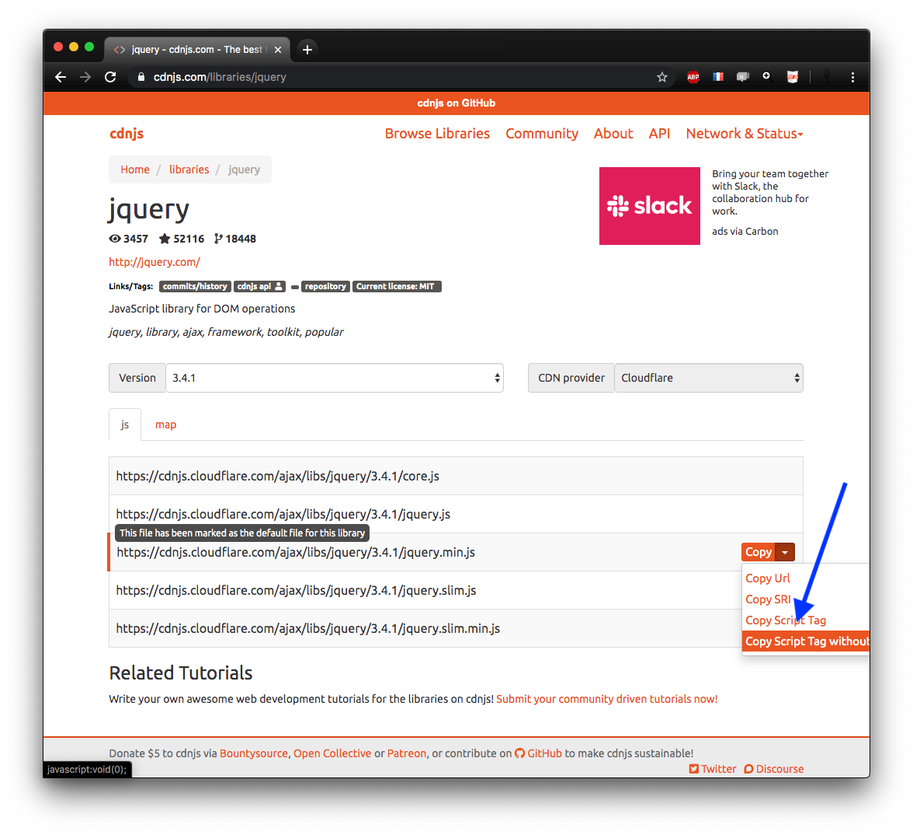
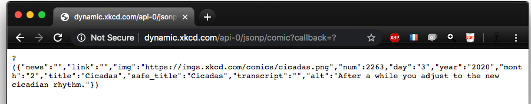
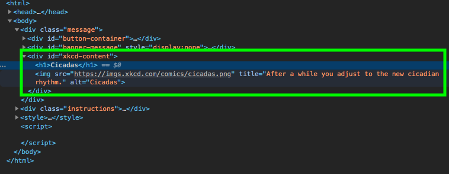

+++ {"slideshow": {"slide_type": "slide"}}

<div class="licence">
<span>Licence CC BY-NC-ND</span>
<span>Thierry Parmentelat</span>
</div>

+++ {"slideshow": {"slide_type": ""}}

# jQuery

```{code-cell}
delete require.cache[require.resolve('../js/toolsv3')]
tools = require('../js/toolsv3')
tools.init()
```

+++ {"slideshow": {"slide_type": "slide"}}

## jQuery is everywhere

+++

jQuery has been around for a very long time  
with the objective to make **common operations**,  
like **interactions with the DOM**   
much **smoother**, and more **cross-browser**

it is embedded in many applications,  
so it is a **must know** component

+++

<p class="rise-footnote"><i>cross-browser</i> means it provides abstractions that will work everywhere, even if the user's browser is old and lacks some features</p>

+++ {"slideshow": {"slide_type": "slide"}}

## digression : cdnjs

+++

* many places where to find 3rd-party libraries like jQuery
* personnally I like <https://cdnjs.com>
* easy to locate resources
* and to import them in your project

+++ {"slideshow": {"slide_type": "slide"}}


+++ {"slideshow": {"slide_type": "slide"}}



+++ {"slideshow": {"slide_type": "slide"}}


+++

it is easy to import the library from your own html documents

+++ {"slideshow": {"slide_type": "slide"}}

## digression$^2$

+++

real applications will use more sophisticated tools to deal with dependencies  
most popular being essentially `npm` and/or `yarn`  
that we will cover briefly in the optional material

however `cdnjs` remains quite convenient  
if you use only a handful of 3rd party tools

+++

<p class="rise-footnote"> jQuery being mostly <b>browser-oriented</b>, 
    running jQuery examples right in the notebook is not possible at this time</p>

+++ {"slideshow": {"slide_type": "slide"}}

## back to jQuery

+++

as per <https://jquery.com>

> **What is jQuery?** 

> jQuery is a fast, small, and feature-rich JavaScript library. It makes things like HTML document traversal and manipulation, event handling, animation, and Ajax much simpler with an easy-to-use API that works across a multitude of browsers. With a combination of versatility and extensibility, jQuery has changed the way that millions of people write JavaScript.

+++ {"slideshow": {"slide_type": "slide"}}

## how to use

+++

* after importing jQuery, the module is available as  
  the global `$` variable  
  (and yes, this is legal in JavaScript)
* you can use `jQuery` instead of `$` if you prefer

+++ {"slideshow": {"slide_type": "slide"}}

## CSS selectors

+++

* the `$` function, when called with a string, interprets it as a CSS selector
* and returns a JavaScript object
* on which further jQuery treatments can be applied
* it will implicitly apply those treatments **on all the matching DOM elements**

+++ {"slideshow": {"slide_type": "slide"}}

### CSS selectors example

+++ {"slideshow": {"slide_type": ""}}

for example this one-liner would hide  
all elements of class `to-hide`
```javascript
$(".to-hide").hide()
```

which is admittedly **a little simpler** than using native JavaScript functions

+++ {"slideshow": {"slide_type": "slide"}}

## event handlers

+++

likewise jQuery makes event handling nicer
```
$("#button-container button").on( 
    "click",
     function( event ) {
        $("#banner-message").show();
});
```

would require much more verbose code if written in pure JavaScript

+++ {"slideshow": {"slide_type": "slide"}}

##  run code at load-time

+++

a **very common idiom** :  

the `$` function, when called **on a function**,  
means to add it to the list of things  
to be done once the page has loaded

```javascript
////// 3 equivalent forms 
// using an arrow function
$(() => console.log("loaded"))

// using an anonymous function
$(function() {console.log("loaded")})

// using a named function
function loaded() {console.log("loaded")}
$(loaded)
```

+++ {"slideshow": {"slide_type": "slide"}}

## networking

+++

* your javascript code is allowed to issue network requests
* here again jQuery has a convenience tool called `$.ajax`
* which makes things easier than with pure JavaScript
* let us see how the example works exactly

+++ {"cell_style": "center", "slideshow": {"slide_type": "slide"}}

### xkcd in the example (1)

[available in a jsfiddle](http://jsfiddle.net/bbalkenhol/mMPXG/)

* first step is to issue a request to the `url`  
  you can use a new browser page, and paste the URL in the address bar  
  you will see the kind of text that the request returns 
  


* this format is called JSON; it is easy to read  
  from any language; you probably already   
  have used data exposed in JSON

+++ {"slideshow": {"slide_type": "slide"}}

### xkcd in the example (2)

+++

* this first request can, and probably will, take a noticeable time
* `$.ajax` arranges so that once it returns:
  * the result is parsed as being a JSON format (`dataType: "json"`)
  * and the `success` callback function triggers
* what the callback does step by step is:
  * search by id the element `#xkcd-content`
  * create under it 2 new sibling elements `<h1>` and ``
  * and fill them with data from the responsed JSON

+++ {"slideshow": {"slide_type": "slide"}}

### xkcd in the example (3)

+++

this is what the DOM looks like after the success callback has completed  
because ``'s `src` attribute has changed  
the browser goes and fetches the actual image content and displays it



+++ {"slideshow": {"slide_type": "slide"}}

## example 2

```{code-cell}
tools.sample_from_stem("../samples/jquery-colors")
```

+++ {"slideshow": {"slide_type": "slide"}}

## chaining

+++

a very general idiom is to select, then apply a **series of changes**  
observe in the example above

```javascript
        $( "#result" )
            .html( `That div is ${color}` )
            .css("color", color);
```

* selection of the target elements  
  (here just one, could have been many)
* apply them the `html()` method to change their content
* and on the same set of elements
* change their css property

+++ {"slideshow": {"slide_type": "slide"}}

## and much more

+++

* jQuery was there at the very beginning  
* as it was both **concise**
  * and **cross-browser**  
    (ensuring the API worked the same everywhere)
* it has become a **de facto standard**
* it is worth taking [a look at the API documentation](https://api.jquery.com/) to get a sense of all the possibilities
* starting maybe with [the section on manipulation](https://api.jquery.com/category/manipulation/)

+++ {"slideshow": {"slide_type": "slide"}}

## status

+++

This library is still very widespread - used in a lot of code - but no longer that popular with new / starting projects, because of all the other newer and fancier stacks (react, ngular, vue)

it makes sense to learn how to read code that uses it - and the above is a good start - but not to invest time in its inner details
