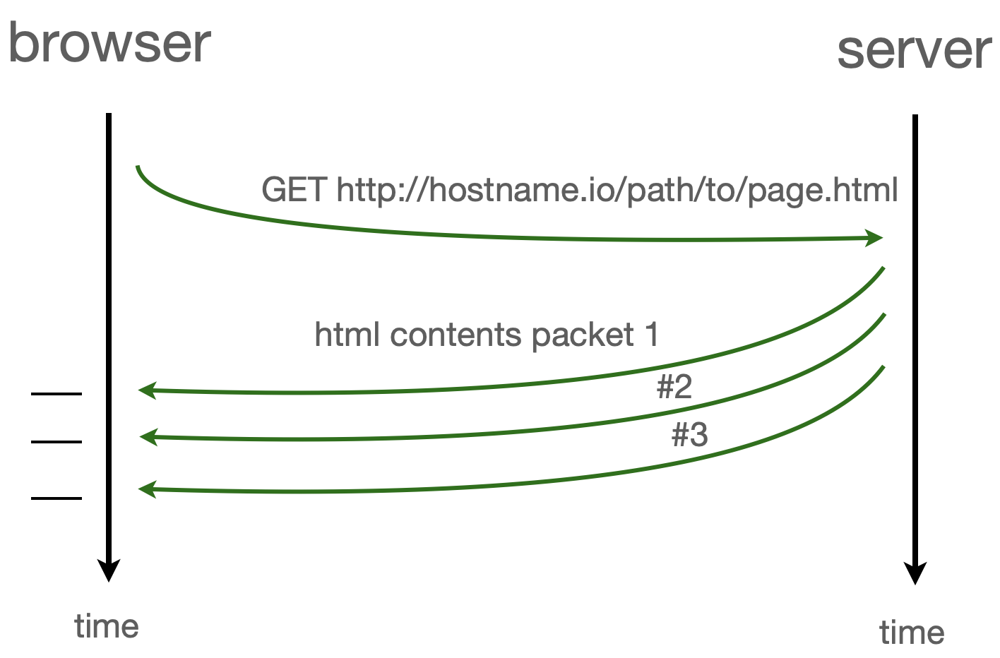
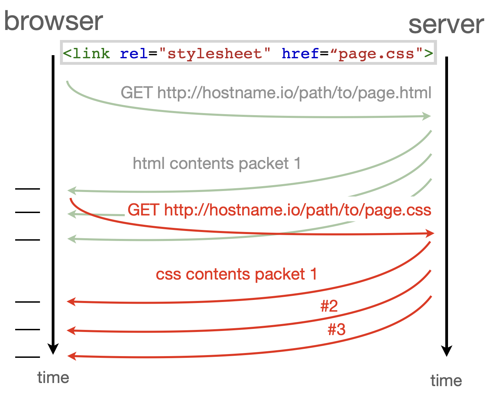
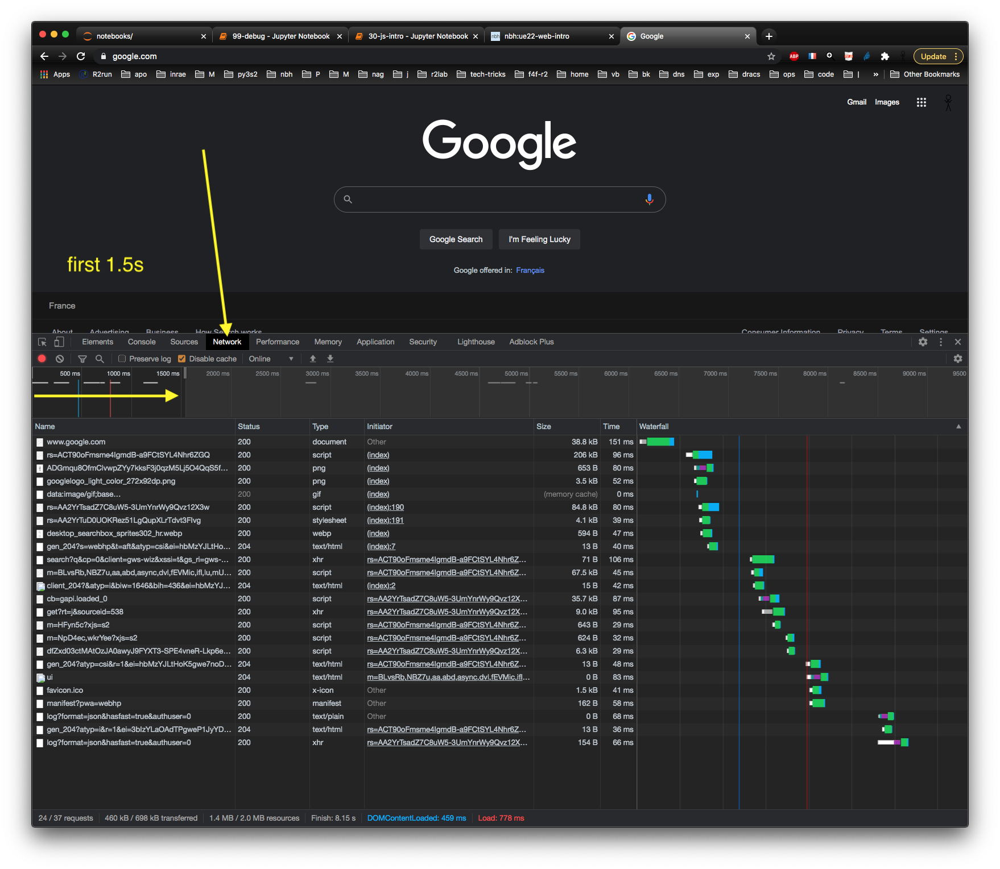

<div class="licence">
<span>Licence CC BY-NC-ND</span>
<span>Thierry Parmentelat</span>
</div>

+++ {"slideshow": {"slide_type": ""}}

# JavaScript

```{code-cell}
delete require.cache[require.resolve('../js/toolsv3')]
tools = require('../js/toolsv3')
tools.init()
```

+++ {"slideshow": {"slide_type": "slide"}}

## Why JavaScript

+++

JavaScript comes in addition to

* HTML for **content**
* CSS for **style**

JavaScript

* it is a full-fledged **programming language** 
* and provides for **behaviour**

+++ {"slideshow": {"slide_type": "slide"}}

## JavaScript characteristics

+++

* runs **inside the browser**(♡)
* has direct **access to the DOM**
* so it can freely **manipulate the HTML**  
* in order to add / remove / **modify content**  
* and/or dynamically **change properties**
* in response to e.g. **user-triggered events**

+++

<div class="rise-footnote">
    
(♡) as mentioned earlier, one can also write "regular" programs in JS using the *node.js* runtime

</div>

+++ {"slideshow": {"slide_type": "slide"}}

## Example #1

+++

in the following example :

* HTML has two elements `#button` et `#area`
* one acts as a button, that can make  the other one visible or not
* we create a **JavaScript function** named `toggle()`
* that locates the `#area` element and changes its `display` property
* then `toggle()` is bound to the `click` event of the button element  
  (using the `onclick` property)

```{code-cell}
---
hide_input: true
slideshow:
  slide_type: slide
---
tools.sample_from_stem("../samples/30-js-intro-01-on-off", 
                       {width: '30em', height: '25em', separate_show: true})
```

+++ {"slideshow": {"slide_type": "slide"}}

#### things to note about example #1  

visibility of symbols (variable and function names) :

* **global** variables `document` and `console` allow to access browser components
* **local** variables inside `toggle` are declared with `let`  (there's a `const` too)
* the `function toggle() ..` statement defines a **global** variable `toggle`
* in HTML, we set the `onclick` property on `#button` it is a JavaScript fragment that refers to the global `toggle` function
  

+++

<div class="rise-footnote">
Using `onclick` is the quick, but dirty, way to attach an event handler to an element; a cleaner way is to use `addEventListener` from the JS side, as we will see later on
</div>

+++ {"slideshow": {"slide_type": "slide"}, "hide_input": true}

## Example 2

+++

in this further example :

* we create two visible elements:   
  a button, and a graphic area `<svg>`
* the page runs a cyclic task  
  that adds a random point 
* button to start / suspend

```{code-cell}
---
hide_input: true
slideshow:
  slide_type: slide
---
tools.sample_from_stem("../samples/30-js-intro-02-svgcircles",
                       {width: '35em', height: '20em', 
                        min_width: '15em', separate_show: true})
```

+++ {"slideshow": {"slide_type": "slide"}}

#### things to note about example #2 :

* adding to the DOM to create new content  
  (createElementNS and append)
* `the_board` is a JavaScript *object*    
  i.e. composite data keyed on `w`, `h`, etc…  
  (more on this later)

+++ {"slideshow": {"slide_type": "slide"}}

#### still on example #2 :

and also, about asynchronicity :

* initialization code messes with the `<svg>`'s attributes 
  * so, the `<svg>` element must have been created **beforehand**
  * a page is made of html + css + js 
  * we have no control on the order  
    in which things happen in the browser
  * **we have no control on the order in which things happen in the browser**
* We need to ensure that init code is executed **after** html elements are created
  * => this is the purpose of `load` event sent to the global `window` object
  * The load event is fired once the entire document is loaded

+++ {"slideshow": {"slide_type": "slide"}, "hide_input": true}

## example 3

+++

in this further example :

* we create two visible elements:   
  a `<div>` label, and this time a `<canvas>` graphic area
* clicking in the canvas causes it to randomize itself

```{code-cell}
---
hide_input: true
slideshow:
  slide_type: slide
---
tools.sample_from_stem("../samples/30-js-intro-03-canvas",
                       {width: '40em', height: '20em', 
                        min_width: '15em', separate_show: true, start_with: 'js'})
```

+++ {"slideshow": {"slide_type": "slide"}}

#### things to note on example #3 :

* the `() => {}` notation to define **anonymous** functions (alike Python's `lambda`s)
* binding the event handler done in JS with `addEventListener()`
* impact of the JS code on **global variables** is zero !

---
and also

* `<svg>` is the ancestor in the graphics area,  
  but many alternatives, like here `<canvas>`
* see e.g. [an overview here](https://cs.lmu.edu/~ray/notes/introjavascriptgraphics/)
* most famous / impressive are probably
  * `d3.js` - see [a gallery](https://observablehq.com/@d3/gallery)
  * `three.js` - see [a gallery](https://threejs.org/examples/#webgl_animation_cloth)

+++ {"slideshow": {"slide_type": "slide"}}

## page loading

+++

### reminder : a few orders of magnitude

* CPU + memory : 1 ns
* storage :
  * SDD : 100 µs
  * HDD : 1-10 ms
* networking :
  * light-speed Paris-SF : 30 ms
  * light-speed Paris-Nice : 3 ms
  * plus, software stack traversals
  * plus, protocols = several back and forths
  * bottom line: more in the **several 100s of ms**
  * frequently several seconds

+++ {"slideshow": {"slide_type": "slide"}}

### a simple page

+++ {"cell_style": "split"}

when loading the simplest possible page, contents get scattered into packets, so it does not arrive all at once

+++ {"cell_style": "split"}



+++ {"slideshow": {"slide_type": "slide"}}

### a page and a nested page

+++ {"cell_style": "split"}

in the case of a page  
that has **a nested page**  
(e.g. a css style)  
there are 2 http requests at work

+++ {"cell_style": "split"}



+++ {"slideshow": {"slide_type": "slide"}}

### loading a real page

+++



+++ {"slideshow": {"slide_type": "slide"}}

## Event-driven

+++

* as opposed to more traditional languages,  
  (think `main()` in C++ or Java,  or the entry module in Python)  
* browser-hosted code has  
  **little control** on overall **order**  
* plus, apps need to **react to events** that can be  
  * **user-**triggered (clicking, ...)
  * **network-**triggered (a page finished loading)
  * or **time-**triggered - some cyclic task is scheduled

+++ {"slideshow": {"slide_type": "slide"}}

## Callbacks

+++

the historical paradigm for event-driven programming :

* one very pervasive pattern in JavaScript 
* is the notion of a **callback** 
* which is a **function**
* attached to some sort of **event**
* and then of course the function gets **fired** when event **occurs**

+++ {"slideshow": {"slide_type": "slide"}}

## Callbacks - continued

+++

in our 3 examples, we have seen 4 callbacks already

* ex.1 : `onclick="toggle()"`  
* ex.2 : `setTimeout(() => this.run(), 500)` 
* ex.2 : `window.addEventListener('load', ...)` 
* ex.3 : `canvas.addEventListener('click', drawShapes)`

+++ {"slideshow": {"slide_type": "slide"}}

## Take home message

+++

as far as Web frontend, JavaScript :

* runs **in the browser**  <span style="font-size: 60%">(and also increasingly used as a regular programming language)</span>
* **full-fledged** modern language, with objects, classes, modules…
* Some globals are specific to web pages in the browser such as `document`, `window`, `console`
* highly influenced by **asynchronicity** / reactive programming
