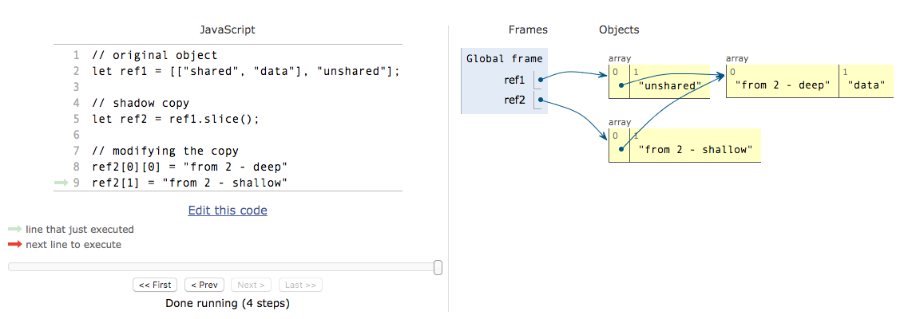

+++ {"slideshow": {"slide_type": "slide"}}

<div class="licence">
<span>Licence CC BY-NC-ND</span>
<span>Thierry Parmentelat</span>
</div>

+++ {"slideshow": {"slide_type": ""}}

# JS builtin types

```{code-cell}
delete require.cache[require.resolve('../js/toolsv3')]
tools = require('../js/toolsv3')
tools.init()
```

+++ {"slideshow": {"slide_type": "slide"}}

## Nothing but the usual

+++

* set of builtin types similar to Python's offering
* atomic : numbers, strings, booleans
* containers : arrays (lists), maps (dicts) and sets
* objects

+++ {"slideshow": {"slide_type": "slide"}}

## atomic types

+++ {"slideshow": {"slide_type": ""}}

* `number` is the default type for numeric values  
* `string`
* `boolean` may be `true` or `false`

```{code-cell}
:cell_style: split

// usual operators, here
// ** is power and 
// % is modulo
(100 ** 9) % 11
```

```{code-cell}
:cell_style: split

// strings with ' or "
let s1 = "abc" + 'def';
let s2 = 'ab' + "cdef";
s1 == s2
```

<p class="rise-footnote">
    <b>beware</b> that <code>number</code> is similar to Python's <code>float</code> -- so <b>with imprecision</b> !  
    <br>
    google for <code>bigint</code> for error-free calculus on integers - like Python's <code>int</code>
</p>

+++ {"slideshow": {"slide_type": "slide"}}

### atomic types (continued)

+++ {"slideshow": {"slide_type": ""}}

* `null` is similar to Python's `None`
* `undefined` 
  * as mentioned earlier, JavaScript is very permissive
  * some expressions return `undefined` instead of raising an exception
* `NaN` is "Not a Number"

```{code-cell}
:cell_style: split

// in anticipation
object = { x: 10, y: 20}

// this in Python would 
// trigger an exception
console.log(object.z)
```

```{code-cell}
:cell_style: split

// unlike Python
3 * "abc" 
```

+++ {"slideshow": {"slide_type": "slide"}}

### boolean operators

+++

the syntax for boolean operators is here again inherited from C / C++ / Java

```{code-cell}
:cell_style: split

if (true && true) {
    console.log(
        "logical and is &&")
}
```

```{code-cell}
:cell_style: split

if (true || false) {
    console.log(
        "logical or is ||")
}
```

```{code-cell}
if ( ! false) console.log("not is ! ")
```

+++ {"slideshow": {"slide_type": "slide"}}

### see also

+++ {"slideshow": {"slide_type": ""}}

for a deeper study :

* [on numbers](https://javascript.info/number)
* [on strings](https://javascript.info/string)
* [operators on booleans](https://javascript.info/logical-operators)

+++ {"slideshow": {"slide_type": "slide"}}

## Arrays 

+++

* similar to Python's `list`s

```{code-cell}
:cell_style: split

// arrays can be heterogeous
let array1 = [1, "two"]

// you can also create an
// empty instance explicitly
let array2 = new Array()
```

```{code-cell}
:cell_style: split

// insert at the end
array2.push(3)
array2.push("four")
array2.push(5)
console.log(array2)
```

```{code-cell}
:cell_style: split

// and get it back
array2.pop()
```

+++ {"slideshow": {"slide_type": "slide"}}

### Common operations on arrays

```{code-cell}
:cell_style: split

// use the concat method
let array = array1.concat(array2)
array
```

```{code-cell}
:cell_style: split

// and NOT addition, 
// it does NOT work like in Python
array1 + array2
```

```{code-cell}
:cell_style: split

// indexing starts at 0 
array[2]
```

```{code-cell}
:cell_style: split

array.length 
```

+++ {"slideshow": {"slide_type": "slide"}}

### Searching

+++

* like with Python lists, searching in an array is **linear** in its length
* so like in Python if you need fast access, use a *Map* instead  
  (more on this right away)

```{code-cell}
:cell_style: split

// searching; >=0 means it is found
console.log(array.indexOf(3))
```

```{code-cell}
:cell_style: split

// otherwise -1
console.log(array.indexOf("absent"))
```

+++ {"slideshow": {"slide_type": "slide"}}

### Iterating over values of an array

+++ {"cell_style": "split"}

* It posible to iterate through an array like python:

```{code-cell}
for (let x of array1) {
    console.log(x);
}
```

* But be carefull of use `of` instead of `in` to iterrate each value
* also notice how to use `let` to define a variable **local** to the `for` loop

+++

### Iterating using indices, ak. enumerate in python

+++

* Using `in` keyword iterate through indices:

```{code-cell}
:cell_style: split

for (let i in array) {
    console.log(i);
}
```

+++ {"slideshow": {"slide_type": "slide"}}

### More on arrays

+++

* as you expect there are many more methods available, like  
  `.sort()`, `.reverse()`  
  `.join()`, `.slice()`, `.splice()`,  
  `.shift()`, `.unshift()` 

* for more details see on *javascript.info*
  * [this article on Arrays](https://javascript.info/array)
  * and [this one on related methods](https://javascript.info/array-methods)
     

+++ {"slideshow": {"slide_type": "slide"}}

### Shared references

+++

* **exactly like in Python**, objects can be access from several references  
* so you need to shallow- or deep-copy depending on your needs

```{code-cell}
:cell_style: split

let ref1 = [["shared", "data"], "unshared"];
ref1 
```

```{code-cell}
:cell_style: split

// slice() works like Python's [:]
// so it's a shallow copy
let ref2 = ref1.slice();
ref2
```

```{code-cell}
:cell_style: split

// changing data from ref2 
ref2[0][0] = "from 2 - deep"
ref2[1] = "from 2 - shallow"
ref2
```

```{code-cell}
:cell_style: split

// impacts ref1 but not on first level
// because it is a shallow copy
ref1
```

+++ {"slideshow": {"slide_type": "slide"}}

### pythontutor illustration




+++ {"slideshow": {"slide_type": "slide"}}

## Hash-based data types

+++

* `Map` and `Set` are JavaScript builtin types
  * that match Python's `dict` and `set` respectively
* they exhibit the same constant-time lookup nice property
* like in Python, **make sure to use them** whenever you need fast searching and indexing

```{code-cell}
:cell_style: split

let map = new Map();

map.set('key1', 'value1');
map.set(1000, 'value1000');

map.get(1000)
```

```{code-cell}
:cell_style: split

// iterating over map
for (let k of map.keys()) {
    console.log(`key=${k}, value=${map.get(k)}`)
}
```

+++ {"slideshow": {"slide_type": "slide"}}

### see also

* read the [section on maps and sets on javascript.info](https://javascript.info/map-set)

+++ {"slideshow": {"slide_type": "slide"}}

## Objects

+++

* as the name suggests, objects are the building block for OOP
* they are similar to Python's class instances
  * in that they can hold attributes (Python vocabulary)
  * that in JavaScript are called key-value pairs

```{code-cell}
:cell_style: split

let bond = {
    first_name: "James",
    last_name: "Bond"
}

console.log(`my name is ${bond.last_name}`);
```

```{code-cell}
:cell_style: split

// check for a key
'first_name' in bond
```

<p class="rise-footnote"> 
    the syntax for JavaScript objects, as well as the <i>key/value</i> vocabulary make them <b>look like</b> Python dictionaries, <b>do not get confused though</b>, JavaScript objects are much more like Python class instances.
</p>

+++ {"slideshow": {"slide_type": "slide"}}

### iterating over an object's keys

+++

* one can access an object's key/attribute with 2 syntaxes
  * `object.first_name` takes the key name litterally
  * `object[var]` **evaluates** `var`, that should give a key name

```{code-cell}
// so we can use this to iterate over an object's contents
for (key in bond) {
    console.log(key, ':', bond[key])
}
```

+++ {"slideshow": {"slide_type": "slide"}}

### Assignment based on objects

+++

reminder : we had already seen array-based assignment which is a Python-style idiom

```{code-cell}
let [a1, a2] = [100, 200];

`a1 now is ${a1}, a2 is ${a2}`
```

there a similar destructuring assignement on objects  

```{code-cell}

let example_obj = {name: "doe", phone: '0123456', other: 'some stuff'};

let {name, phone} = {...example_obj};

`name now is ${name}, phone is ${phone}`
```

+++ {"slideshow": {"slide_type": "slide"}}

## class instances are objects

```{code-cell}
class Person {
    constructor(first, last) {
        this.first_name = first;
        this.last_name = last;
    }
}

let person = new Person("John", "Doe")

typeof(person)
```

+++ {"slideshow": {"slide_type": "slide"}}

## arguments are passed by reference

+++

* like in Python, when passing a composite object  
  (array, map, object, …) to a function
* you pass a **reference** (not a copy),  
  so the function can alter its parameter

```{code-cell}
:cell_style: split

// on an array
function side_effect(arg) {
    arg[1] *= 1000;
}

let list = [0, 1, 2];
side_effect(list);
list
```

```{code-cell}
:cell_style: split

// same with objects
function change_object(obj) {
    obj.first_name = 'BOOM';
}

let person2 = new Person('John Doe')
change_object(person2)
person2
```

+++ {"slideshow": {"slide_type": "slide"}}

## arguments passing is loosely checked

```{code-cell}
// just display arguments
function foo(x, y, z) {
    console.log(`x=${x}, y=${y}, z=${z}`);
}
```

```{code-cell}
:cell_style: split

// works fine, of course
foo(1, 2, 3)
```

```{code-cell}
:cell_style: split

// works fine TOO !
foo(1, 2)
```

```{code-cell}
// and this one AS WELL
foo(1, 2, 3, 4)
```

+++ {"slideshow": {"slide_type": "slide"}}

### more on arguments

+++

* unlike Python there is no named arguments ak. `foo(arg0=10)`
* nor of arguments with default values
* **there is** however a way to deal with variable number of arguments

```{code-cell}
// equivalent to Python's 
// def bar(x, y, *args):

function bar(x, y, ...arguments) {
    // display what we receive
    console.log(`x=${x}, y=${y}`);
    console.log(`arguments=${arguments}`);
    // the arguments object can be iterated on
    for (let arg of arguments) {
        console.log(arg);
    }
}

// with this call, the 2 extra args are captured 
bar(1, 2, 3, 4)
```
