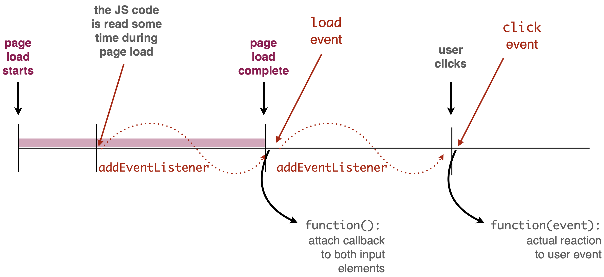

+++ {"slideshow": {"slide_type": "slide"}}

<div class="licence">
<span>Licence CC BY-NC-ND</span>
<span>Thierry Parmentelat</span>
</div>

+++ {"slideshow": {"slide_type": ""}}

# asynchronism in JavaScript

```{code-cell}
delete require.cache[require.resolve('../js/toolsv3')]
tools = require('../js/toolsv3')
tools.init()
```

+++ {"slideshow": {"slide_type": "slide"}}

## Sequential programming model

+++

in the traditional languages we have seen so far  

* a program has **one entry point**  
  (e.g. `python foo.py` in Python, `main()` from `a.out` in C++, etc…)
* and it mostly does **one thing** at a time  
  in the order specified in the code  
  starting from the entry point

+++

<p class="rise-footnote"> 
these traditional languages do have some tools to deal with 
more concurrency, and we will cover that briefly in later courses
</p>

+++ {"slideshow": {"slide_type": "slide"}}

## asynchroneous environment

+++ {"slideshow": {"slide_type": ""}}

within the browser though, things are different

* what is the entry point ?
* the browser does many things on its own or upon actions triggered by the user all at the same time
* also, as importantly the browser's main job being to fetch data on the network these are structurally slow operations
* but users expect the browser to be always responsive

+++ {"slideshow": {"slide_type": "slide"}}

## Callbacks everywhere

+++

**callbacks** are one first relatively naive approach to asynchronicity 

* a function that is passed as an argument
* so that it gets triggered in the future
* when some conditions are met

we have seen many examples already

```javascript
// trigger once the document is loaded
window.addEventListener(
    "load", 
    function() { console.log("page loaded"); }
);

// trigger in a fixed amount of time
setTimeout(
    function () { console.load("10 seconds later"); },
    10000);
```


+++ {"slideshow": {"slide_type": "slide"}}

### Callbacks

+++

in this context, it is common to create functions **on the fly** with e.g. the `function` expression

```javascript
window.addEventListener(
    "load", 
    // returns a function object
    function() { console.log("page loaded"); }  
);
```

+++

<p class="rise-footnote">this style of creating function objects is extremely common in JavaScript; it is kind of close to `lambda` expressions in Python.

+++ {"slideshow": {"slide_type": "slide"}}

## Closures

+++

* it is rather frequent that a callback needs to access data that sit outside the function context
* it is safe to use lexically-bound variables inside the callback
* see the `context` variable in the example below

```{code-cell}
// here the 'context' variable is not visible
{ 
    let context = {a:1, b:2};
    setTimeout( 
        function() {
            // Here the 'context' variable is visible and remain valid
            // even if we leave the block
            console.log("context is", context);
        },
        2000);
    console.log("NOW timeout armed");
} 
// here neither
try {
    context
} catch(err) {
    console.log(`OOPS ${err.message}`)
}
```

+++ {"slideshow": {"slide_type": "slide"}}

### closures - continued

+++ {"cell_style": "split"}

```javascript
{ 
  let context = {a:1, b:2};
  setTimeout( 
    function() {
      console.log(context);
    },
    2000);
  console.log("armed");
}
```

+++ {"cell_style": "split"}

* `context` is created in a block
* that is long gone at the time the callback triggers
* but it is still reachable from the callback
* as it was *captured* in the closure

+++ {"slideshow": {"slide_type": "slide"}}

## Arrow functions

+++

an alternative syntax to create functions on the fly

```{code-cell}
:cell_style: split

// this expression returns 
// a function object
(x) => { console.log(`PING x=${x}`); }
```

```{code-cell}
:cell_style: split

// we could also have named it
// 
let foo = (x) => { console.log(`PING x=${x}`); };
foo;
```

```{code-cell}
:cell_style: split

// so that we could call it
foo(10)
```

```{code-cell}
:cell_style: split

// a common idiom 
setTimeout(
    () => {console.log("PONG")},
    1000);
console.log("armed")
```

+++ {"slideshow": {"slide_type": "slide"}}

## the limits of callbacks

+++

* highly recommended to study the [introduction to callbacks in javascript.info](https://javascript.info/callbacks)
* that highlights the fundamental drawback of using callbacks
* which is that you need to split your code into pieces and fit the pieces into functions
* it easily becomes hard to read and modify especially if there is logic involved

+++ {"slideshow": {"slide_type": "slide"}}

## Events

+++

so far we have seen a few types of events

* mostly "load" that is rather crucial
* there are also builtin events for keyboard / mouse interaction illustrated on the next example (we use `click` and `keydown`)
* for more details, see [this section in javascript.info](https://javascript.info/event-details) on all the vailable events

+++ {"slideshow": {"slide_type": "slide"}}

### `addEventListener`

+++

* a fundamental tool to record callback with an event
* available on most objects
* observe on the example how the callbacks receive the event in parameter
* and because we use `console.log(event)` we have the option to inspect the event object in the console, and see all its attributes

+++ {"slideshow": {"slide_type": "slide"}}

### Events example

```{code-cell}
:hide_input: true

tools.sample_from_stem("../samples/35-async-01-events",
                       {separate_show: true, width: '40em'})
```



+++ {"slideshow": {"slide_type": "slide"}}

### Example - observations

+++

notice from the example :

* how `addEventLister()` are cascaded, just like in the 'pyramid of Doom`
* how we display the events with `console.log()`  
  this is useful technique for debugging / inspecting data
* how we inspect the event object to display meaningful data
* also that the `.js` file does not export any symbol 

+++ {"slideshow": {"slide_type": "slide"}}

## Promises

+++

a relatively new alternative to callbacks that tries to address the 'pyramid of Doom' as described in the article mentioned above

the following example tries to illustrate

* that promises can deal with error conditions
* and that they allow to pass return values along the chain

as you will see however, it clearly gets some time to be able to read promises fluently :)

```{code-cell}
---
slideshow:
  slide_type: slide
---
// this is just an accessory cell

// we declare a variable that will 

// the next cell will run OK 
// for the first time
// and fail for the second time

failure_toggle = 1
```

```{code-cell}
---
slideshow:
  slide_type: slide
---
new Promise(
    function(resolve, reject) {

        // make it work or fail every other time
        failure_toggle = ! failure_toggle;
      
        // a promise must use resolve or reject exactly once
        // depending on successful or not
        if ( failure_toggle) {
            // in case of failure, do not wait
            reject(1);
        } else {
            // in case of success, wait for 1 s
            setTimeout(() => resolve(1), 500);
        }
    }).then(
        // first argument to then is in case of success (resolve is used)
        (result) => { console.log(result); 
                      return result * 2;},
        // second is for the cases where reject is called
        (result) => console.log(`error with ${result}`)
    ).then(
      function(result) { 
          console.log(result); 
          return result * 3;
});
```

+++ {"slideshow": {"slide_type": "slide"}}

### more on promises and async

for those interested, more details on promises can be found in the rest of [this chapter on javascript.info](https://javascript.info/async) [starting here](https://javascript.info/promise-basics)

+++

## `async` keyword 

+++

With `async` you can delare fonction that are `Promise` by default

```{code-cell}
// when called this fonction will be a promise as the previous code
async function foo() {
        // make it work or fail every other time
        failure_toggle = ! failure_toggle;
      
        // a promise must use resolve or reject exactly once
        // depending on successful or not
        if ( failure_toggle) {
            // in case of failure, do not wait
            throw 1; // Equivalent to reject(1);
        } else {
            // in case of success, wait for 1 s
            return 1; // Equivalent to resolve(1);
        }
    }

// Call the function as promise
foo().then(
        // first argument to then is in case of success (resolve is used)
        (result) => { console.log(result); 
                      return result * 2;},
        // second is for the cases where reject is called
        (result) => console.log(`error with ${result}`)
).then(
      function(result) { 
          console.log(result); 
          return result * 3;
});
```

## `await` keyword

+++

* The keyword `await` allow to wait for the result of a promise
* `await` can only used in `async` function
* They cannot be used in the global scope

```{code-cell}
async function foo() {
    // make it work or fail every other time
    failure_toggle = ! failure_toggle;

    // a promise must use resolve or reject exactly once
    // depending on successful or not
    if ( failure_toggle) {
        // in case of failure, do not wait
        throw 1; // Equivalent to reject(1);
    } else {
        // in case of success, wait for 1 s
        return await new Promise((resolve, reject) => setTimeout(() => resolve(1) , 3000));
    }
}

// Call the function as promise
foo().then(
        // first argument to then is in case of success (resolve is used)
        (result) => { console.log(result); 
                      return result * 2;},
        // second is for the cases where reject is called
        (result) => console.log(`error with ${result}`)
).then(
      function(result) { 
          console.log(result); 
          return result * 3;
});
```
